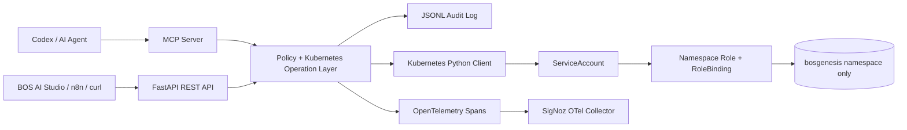

# BOS Genesis Kubernetes Inspector MCP

`bosgenesis-k8s-inspector-mcp` is a namespace-scoped Kubernetes MCP/REST service for BOS Genesis.

It allows Codex, BOS AI Studio, n8n, LangGraph, or another controlled agent runtime to inspect and operate Kubernetes resources **only inside the configured namespace**.

Default namespace:

```text
bosgenesis
```

The project is intentionally designed with:

- no cluster-admin access
- no cross-namespace access
- no direct access to Kubernetes secrets
- no RBAC mutation access
- policy validation before every write
- API-key enforcement before every write
- JSONL audit logging
- OpenTelemetry traces to SigNoz
- config-file-based settings that can later be replaced with Vault

---

## 1. What this project provides

### REST API

Useful for curl, BOS AI Studio, n8n, and simple integrations.

Main endpoints:

```text
GET  /health
POST /mcp
GET  /namespace/summary
GET  /pods
GET  /pods/{pod_name}
GET  /pods/{pod_name}/logs
GET  /services
GET  /deployments
GET  /statefulsets
GET  /ingresses
GET  /events
POST /apply
POST /create
POST /update
POST /delete
POST /deletecollection
POST /patch
POST /bind
POST /scale/deployment
```

### MCP tools

Useful for Codex or other MCP-compatible clients over stdio or Streamable HTTP.

Remote MCP endpoint:

```text
http://k8s-inspector.bosgenesis.local/mcp
```

Tools:

```text
k8s_namespace_summary
k8s_list_pods
k8s_describe_pod
k8s_get_pod_logs
k8s_list_services
k8s_list_deployments
k8s_list_statefulsets
k8s_list_ingresses
k8s_list_events
k8s_apply_manifest
k8s_create_resource
k8s_update_resource
k8s_delete_resource
k8s_delete_collection
k8s_patch_resource
k8s_bind_pod
k8s_scale_deployment
```

---

## 2. Architecture



---

## 3. Safety model

The service is protected by two layers.

### Kubernetes RBAC boundary

The Kubernetes `Role` is created only inside the `bosgenesis` namespace.

The service account does **not** receive:

```text
cluster-admin
ClusterRoleBinding
access to all namespaces
node access
namespace access
secret access
RBAC write access
```

### Application policy boundary

Before calling Kubernetes, the application validates:

```text
metadata.namespace == bosgenesis
resource is allowed
kind is not cluster-scoped
kind is not blocked
pod security settings are safe
mutation request includes the configured API key
```

Default blocked items:

```text
secrets
serviceaccounts
roles
rolebindings
clusterroles
clusterrolebindings
nodes
namespaces
persistentvolumes
customresourcedefinitions
pods/exec
pods/attach
pods/portforward
hostNetwork
hostPID
hostIPC
hostPath
privileged containers
serviceAccountName override
```

---

## 4. Configuration

Configuration is currently file-based and environment-variable-based.

Later this can be replaced by Vault without changing the core operation layer.

### Files

```text
config/settings.yaml
config/policy.yaml
.env.example
```

### Important environment variables

```text
BOSGENESIS_ALLOWED_NAMESPACE=bosgenesis
BOSGENESIS_K8S_AUTH_MODE=in_cluster
BOSGENESIS_KUBECONFIG_PATH=/config/kubeconfig
BOSGENESIS_API_KEY=change-me-later
BOSGENESIS_MCP_ALLOWED_HOSTS=k8s-inspector.bosgenesis.local,bosgenesis-k8s-inspector-mcp.bosgenesis.svc
BOSGENESIS_OTEL_EXPORTER_OTLP_ENDPOINT=http://signoz-otel-collector.signoz:4317
```

For local testing, use:

```text
BOSGENESIS_K8S_AUTH_MODE=kubeconfig
BOSGENESIS_KUBECONFIG_PATH=/path/to/namespace-limited/kubeconfig
```

For Kubernetes deployment, use:

```text
BOSGENESIS_K8S_AUTH_MODE=in_cluster
```

---

## 5. Local development

```bash
cd bosgenesis-k8s-inspector-mcp
python -m venv .venv
source .venv/bin/activate
pip install -e ".[dev]"
cp .env.example .env
```

Edit `.env`:

```text
BOSGENESIS_K8S_AUTH_MODE=kubeconfig
BOSGENESIS_KUBECONFIG_PATH=/your/path/to/kubeconfig
BOSGENESIS_ALLOWED_NAMESPACE=bosgenesis
```

Run REST API:

```bash
python -m bosgenesis_k8s_inspector_mcp.server_fastapi
```

Open:

```text
http://localhost:8080/health
http://localhost:8080/mcp
```

Run MCP server over stdio:

```bash
python -m bosgenesis_k8s_inspector_mcp.server_mcp
```

The REST API process also mounts the same MCP tool surface at `/mcp` for remote clients.

---

## 6. Build Docker image

```bash
docker build -t bosgenesis-k8s-inspector-mcp:0.1.0 .
```

For containerd-based local Kubernetes:

```bash
docker save bosgenesis-k8s-inspector-mcp:0.1.0 -o bosgenesis-k8s-inspector-mcp-0.1.0.tar
sudo ctr -n k8s.io images import bosgenesis-k8s-inspector-mcp-0.1.0.tar
```

Or with nerdctl:

```bash
nerdctl -n k8s.io build -t bosgenesis-k8s-inspector-mcp:0.1.0 .
```

---

## 7. Deploy to Kubernetes

Create the API key secret first. Keep the real `k8s/secret.yaml` local; it is ignored by git.

```bash
cp k8s/secret.example.yaml k8s/secret.yaml
# edit k8s/secret.yaml
kubectl apply -f k8s/secret.yaml
kubectl apply -f k8s/serviceaccount.yaml
kubectl apply -f k8s/role.yaml
kubectl apply -f k8s/rolebinding.yaml
kubectl apply -f k8s/configmap.yaml
kubectl apply -f k8s/deployment.yaml
kubectl apply -f k8s/service.yaml
kubectl apply -f k8s/ingress.yaml
```

Or, after creating the secret separately:

```bash
kubectl apply -k k8s/
```

Validate:

```bash
kubectl get pod,svc,ingress -n bosgenesis | grep k8s-inspector
curl http://k8s-inspector.bosgenesis.local/health
```

Codex remote MCP URL:

```text
http://k8s-inspector.bosgenesis.local/mcp
```

---

## 8. Example requests

### List pods

```bash
curl -H "X-API-Key: replace-me-before-deploy" \
  http://k8s-inspector.bosgenesis.local/pods | python -m json.tool
```

### Namespace summary

```bash
curl -H "X-API-Key: replace-me-before-deploy" \
  http://k8s-inspector.bosgenesis.local/namespace/summary | python -m json.tool
```

### Dry-run apply ConfigMap

```bash
bash examples/apply_configmap_dry_run.sh
```

### Dry-run delete ConfigMap

```bash
bash examples/delete_configmap_dry_run.sh
```

---

## 9. Audit and SigNoz

Every operation emits:

1. JSON structured logs to stdout
2. JSONL audit file inside the pod
3. OpenTelemetry spans to SigNoz when enabled

Default audit file:

```text
/var/log/bosgenesis-k8s-inspector/audit.jsonl
```

Default OTLP endpoint:

```text
http://signoz-otel-collector.signoz:4317
```

Audit event fields include:

```text
audit_id
timestamp
correlation_id
actor
action
resource
namespace
name
status
request
response_summary
error
```

---

## 10. Codex prompt example

Use a prompt like this after the MCP/API is running:

```text
Use the BOS Genesis Kubernetes Inspector MCP only.
Only operate inside the bosgenesis namespace.
First list pods and services.
Then summarize which pods are unhealthy, restarting, or not ready.
Do not inspect anything outside bosgenesis.
Do not read secrets.
Do not use kubectl directly.
```

For mutation tasks:

```text
Use the BOS Genesis Kubernetes Inspector MCP only.
Prepare a dry-run patch first.
Show me the planned change.
Only after I approve, apply the real change.
Only operate inside bosgenesis.
Use dry_run=true before real create/update/patch/delete/deletecollection/bind operations.
```

---

## 11. Current limitations

This first implementation is intentionally conservative.

Not included yet:

```text
Vault integration
human approval workflow
OPA/Kyverno policy integration
persistent audit database sink
multi-namespace mode
secret management
secret object create/update/patch/delete
pod exec / attach / port-forward
```

Recommended next versions:

| Version | Add |
|---|---|
| v0.2 | Approval mode for writes |
| v0.3 | PostgreSQL/MongoDB audit sink |
| v0.4 | Vault config and secret loading |
| v0.5 | OPA/Kyverno preflight policy checks |
| v0.6 | BOS AI Studio UI page |

---

## 12. Important warning

This service can create, update, patch, bind, delete, and delete filtered collections of allowed resources inside `bosgenesis`.

Even with namespace-only RBAC, mutation access is powerful. Keep the following defaults unless there is a strong reason to loosen them:

```text
block secrets
block RBAC resources
block service account creation/override
block pod exec
block hostPath
block privileged containers
require audit logging
prefer dry-run first for Codex-generated changes
```
