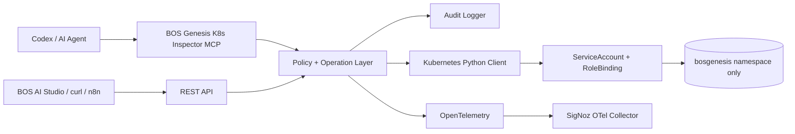
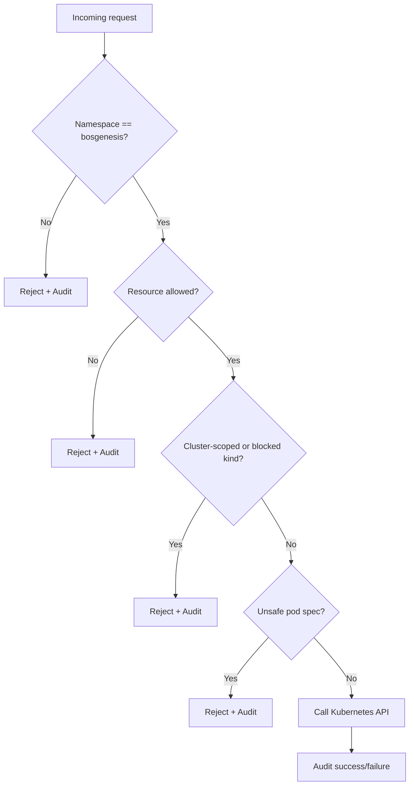
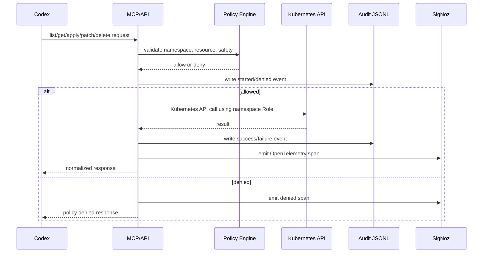
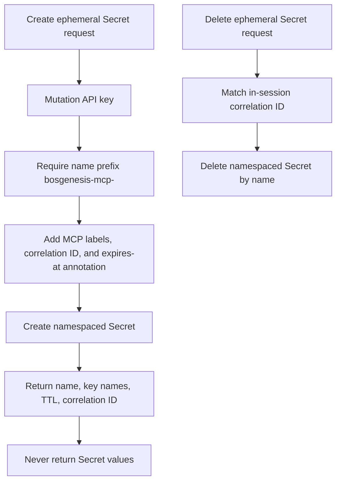

# Architecture

## Security boundary

## Audit flow

## ConfigMap read boundary

ConfigMaps are allowed namespaced application configuration resources, but they can still contain sensitive values when applications misuse them. The direct ConfigMap read surface is therefore intentionally split:

- `k8s_list_configmaps` and `GET /configmaps` return names, labels, annotations, and key names only.
- `k8s_get_configmap` and `GET /configmaps/{configmap_name}` return key names by default.
- ConfigMap values are returned only when the caller explicitly sets `include_data=true`.

This does not change the hard Secret read guardrail. Kubernetes Secrets remain blocked for generic operations, and RBAC grants only create/delete for the dedicated ephemeral Secret workflow.

## Ephemeral Secret boundary

The MCP server has a narrow write-only Secret exception for installation workflows that need Kubernetes Secret references.

There are still no Secret read, list, describe, update, patch, or generic apply paths. The Kubernetes Role grants `create` and `delete` for Secrets only, not `get`, `list`, `watch`, `update`, or `patch`.
