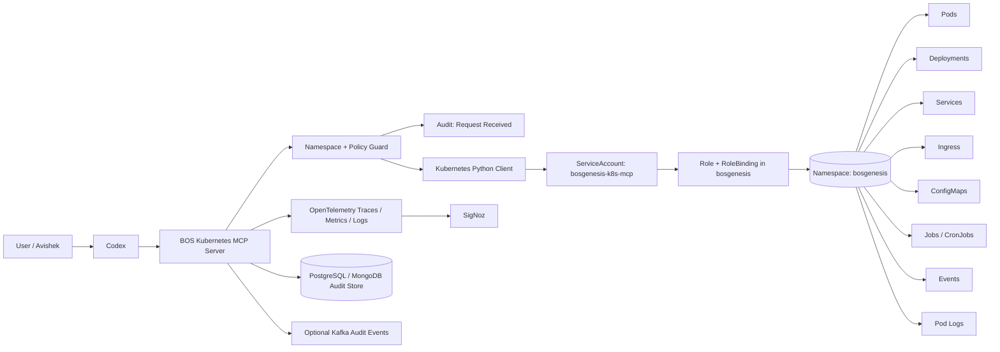
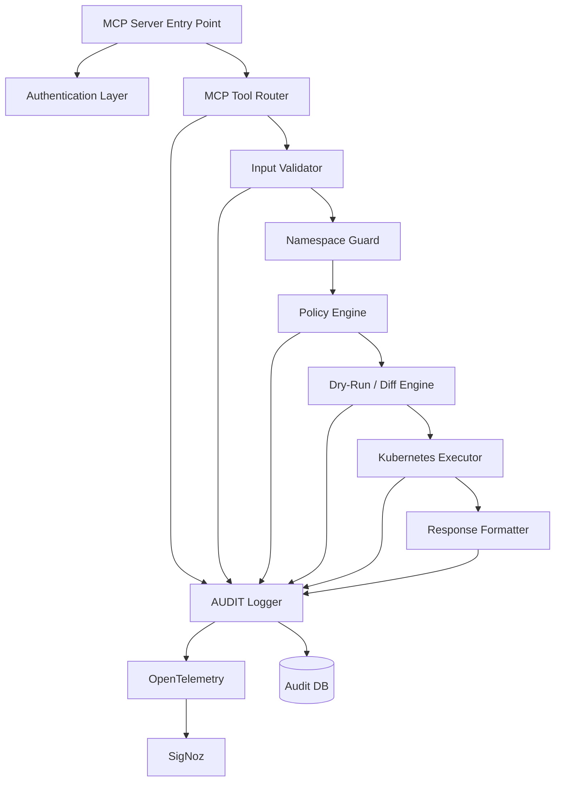
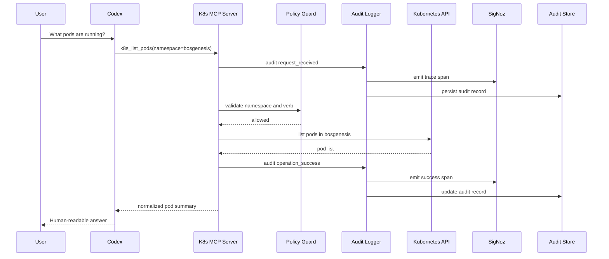
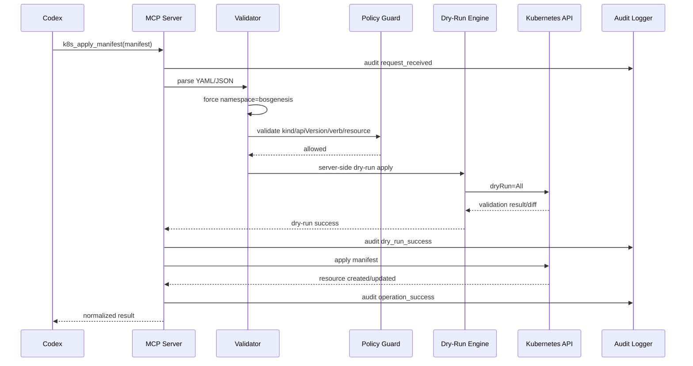
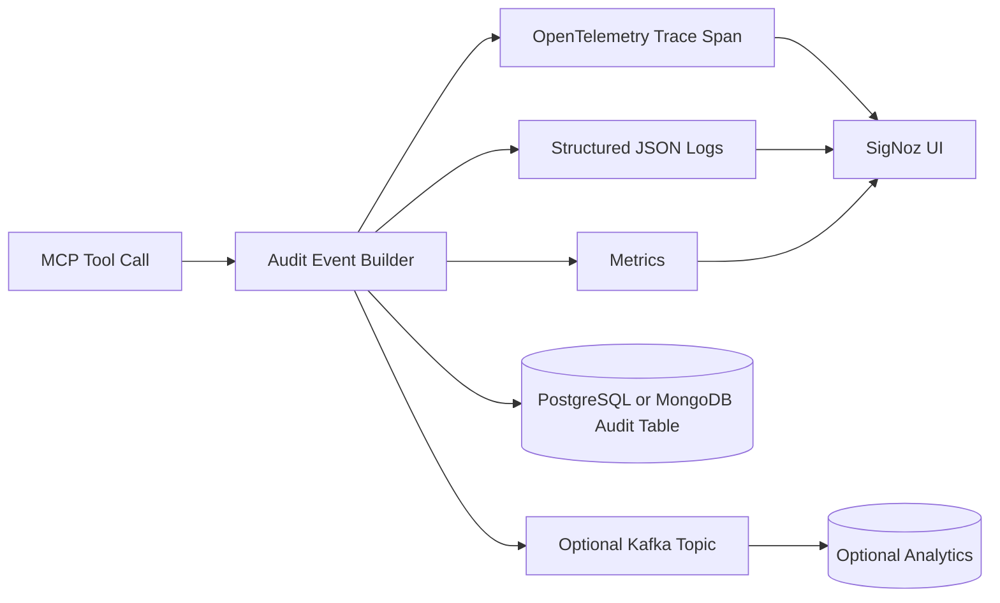
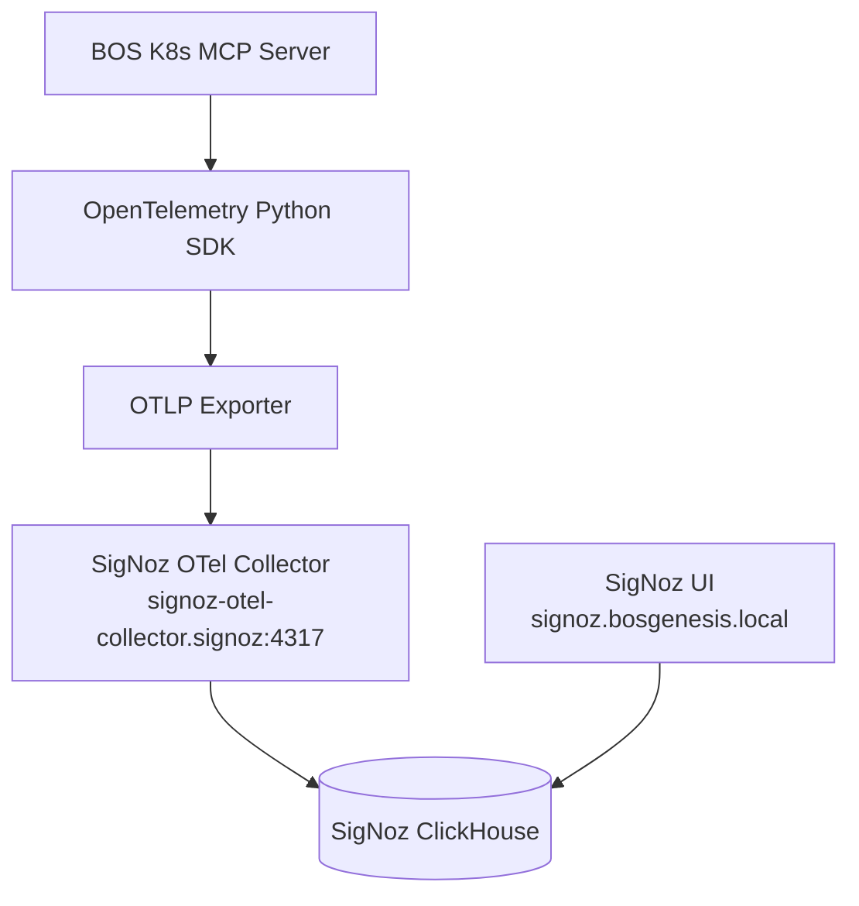
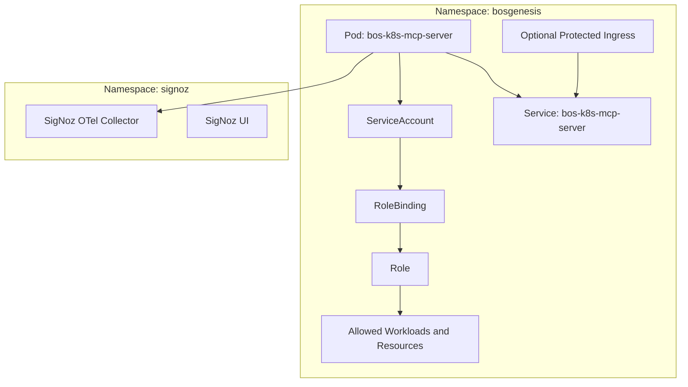

# BOS Genesis Kubernetes MCP Server — Namespace-Scoped Operations & Audit Design

**Document status:** Draft v1.0  
**Target platform:** BOS Genesis / BOS AI Studio  
**Target namespace:** `bosgenesis`  
**Primary objective:** Allow Codex or BOS Genesis agents to safely inspect and operate Kubernetes resources inside one namespace only, with full auditability.  

---

## 1. Executive Summary

This document proposes a **namespace-scoped Kubernetes MCP server** for BOS Genesis.

The MCP server will allow Codex and other approved agents to perform controlled Kubernetes operations such as:

- list resources
- inspect resources
- create resources
- update resources
- patch resources
- delete resources
- fetch pod logs
- inspect events
- summarize health

The MCP server must enforce one hard boundary:

> It can operate only inside the approved namespace, for example `bosgenesis`. It must not inspect, mutate, or infer anything outside that namespace.

The recommended implementation is a small **FastAPI + MCP-compatible service** running inside Kubernetes with a dedicated ServiceAccount, namespace-only Role/RoleBinding, OpenTelemetry instrumentation, and audit logging to SigNoz plus a durable audit store.

---

## 2. Design Goals

| Goal | Description |
|---|---|
| Namespace-only control | All operations are restricted to `bosgenesis` or a configured allowlisted namespace. |
| No super-admin access | No `cluster-admin`, no cluster-scoped mutation, no node access, no namespace creation/deletion. |
| Controlled write support | Add/update/delete is allowed only for approved namespaced resources and approved verbs. |
| Audit every action | Every MCP tool call must produce an audit event with actor, request, decision, result, and correlation ID. |
| Safe destructive operations | Delete/replace/scale operations require dry-run, validation, and optional approval mode. |
| Codex-friendly interface | Codex should call clean MCP tools such as `k8s_list_pods`, not raw `kubectl`. |
| BOS Genesis aligned | The service fits the existing BOS Genesis MCP, A2A, SigNoz, Langfuse, Kafka, MongoDB, ClickHouse, and PostgreSQL direction. |

---

## 3. Non-Goals

This design does **not** aim to provide:

- cluster-wide Kubernetes administration
- direct access to all namespaces
- unrestricted `kubectl` shell access
- read access to Kubernetes Secrets by default
- permission to modify RBAC, ClusterRoles, ClusterRoleBindings, Nodes, Namespaces, PVs, or admission controllers
- autonomous production mutation without human-approved policy controls

---

## 4. High-Level Architecture



---

## 5. Recommended Runtime Placement

The MCP server should run **inside the same Kubernetes cluster** and preferably inside the same namespace:

```text
Namespace: bosgenesis
Service: bos-k8s-mcp-server
ServiceAccount: bosgenesis-k8s-mcp
Ingress: optional, protected
Internal URL: http://bos-k8s-mcp-server.bosgenesis.svc.cluster.local:8080
```

Recommended access pattern:

```text
Codex / local client / BOS AI Studio
  -> protected MCP endpoint
  -> MCP server validates namespace and policy
  -> Kubernetes API using in-cluster ServiceAccount
```

---

## 6. Security Boundary

### 6.1 Hard Namespace Boundary

The server should not trust user-provided namespace values. Namespace handling should follow one of these two safe models:

**Option A — Hardcoded namespace**

```text
ALLOWED_NAMESPACE=bosgenesis
```

All API calls internally force:

```python
namespace = settings.ALLOWED_NAMESPACE
```

**Option B — Allowlist namespace**

```text
ALLOWED_NAMESPACES=bosgenesis
```

A request for any namespace outside the allowlist is rejected before reaching the Kubernetes API.

Recommended for first version:

```text
Option A — hardcoded namespace
```

---

## 7. RBAC Design

### 7.1 ServiceAccount

```yaml
apiVersion: v1
kind: ServiceAccount
metadata:
  name: bosgenesis-k8s-mcp
  namespace: bosgenesis
```

### 7.2 Namespace Role

The Role must be created only in the `bosgenesis` namespace.

```yaml
apiVersion: rbac.authorization.k8s.io/v1
kind: Role
metadata:
  name: bosgenesis-k8s-mcp-role
  namespace: bosgenesis
rules:
  - apiGroups: [""]
    resources:
      - pods
      - pods/log
      - services
      - endpoints
      - configmaps
      - persistentvolumeclaims
      - events
    verbs: ["get", "list", "watch", "create", "update", "patch", "delete"]

  - apiGroups: ["apps"]
    resources:
      - deployments
      - replicasets
      - statefulsets
      - daemonsets
    verbs: ["get", "list", "watch", "create", "update", "patch", "delete"]

  - apiGroups: ["batch"]
    resources:
      - jobs
      - cronjobs
    verbs: ["get", "list", "watch", "create", "update", "patch", "delete"]

  - apiGroups: ["networking.k8s.io"]
    resources:
      - ingresses
      - networkpolicies
    verbs: ["get", "list", "watch", "create", "update", "patch", "delete"]
```

### 7.3 RoleBinding

```yaml
apiVersion: rbac.authorization.k8s.io/v1
kind: RoleBinding
metadata:
  name: bosgenesis-k8s-mcp-binding
  namespace: bosgenesis
subjects:
  - kind: ServiceAccount
    name: bosgenesis-k8s-mcp
    namespace: bosgenesis
roleRef:
  kind: Role
  name: bosgenesis-k8s-mcp-role
  apiGroup: rbac.authorization.k8s.io
```

### 7.4 Strong Recommendation: Exclude High-Risk Resources Initially

Even though the user goal is add/delete/update/list inside one namespace, the following resources should be excluded from v1 because they can introduce security or stability risk:

| Resource | Recommendation | Reason |
|---|---|---|
| `secrets` | Exclude from v1 | Avoid credential leakage. |
| `roles` / `rolebindings` | Exclude from v1 | Avoid privilege escalation within namespace. |
| `serviceaccounts` | Exclude from v1 | Avoid credential and permission confusion. |
| `resourcequotas` | Exclude from v1 | Could disrupt namespace capacity. |
| `limitranges` | Exclude from v1 | Could disrupt workload scheduling. |
| `pods/exec` | Exclude from v1 | Equivalent to shell access inside containers. |
| `pods/portforward` | Exclude from v1 | Can bypass normal network exposure controls. |

These can be added later behind explicit approval and stronger policy controls.

---

## 8. MCP Server Logical Components



---

## 9. MCP Tool Catalog

### 9.1 Read Tools

| Tool | Purpose |
|---|---|
| `k8s_namespace_summary` | Summarize all major resources in the namespace. |
| `k8s_list_pods` | List pods with status, readiness, node, restart count, and age. |
| `k8s_describe_pod` | Describe one pod. |
| `k8s_get_pod_logs` | Read recent logs for one pod/container. |
| `k8s_list_deployments` | List deployments and replica status. |
| `k8s_describe_deployment` | Inspect one deployment. |
| `k8s_list_services` | List services. |
| `k8s_list_ingresses` | List ingress hosts and paths. |
| `k8s_list_configmaps` | List ConfigMaps without dumping sensitive content by default. |
| `k8s_list_events` | List recent namespace events. |
| `k8s_list_jobs` | List Jobs and CronJobs. |

### 9.2 Write Tools

| Tool | Purpose | Safety Control |
|---|---|---|
| `k8s_apply_manifest` | Create/update approved namespaced resources. | Namespace rewrite + dry-run + policy validation. |
| `k8s_patch_resource` | Patch a supported resource. | Allowed resource list + field restrictions. |
| `k8s_delete_resource` | Delete a supported resource. | Confirm flag + dry-run + audit. |
| `k8s_scale_deployment` | Scale one deployment. | Min/max replica policy. |
| `k8s_restart_deployment` | Restart deployment by patching annotation. | Deployment-only. |
| `k8s_create_configmap` | Create/update ConfigMap. | Size and key validation. |
| `k8s_create_job` | Create a one-time Job. | Image allowlist optional. |

---

## 10. Request Lifecycle



---

## 11. Write Operation Lifecycle



---

## 12. Policy Model

### 12.1 Static Policy File

Start simple with a YAML policy file:

```yaml
allowed_namespace: bosgenesis

allowed_resources:
  - group: ""
    versions: ["v1"]
    resources: ["pods", "services", "configmaps", "persistentvolumeclaims"]
    verbs: ["get", "list", "watch", "create", "update", "patch", "delete"]

  - group: "apps"
    versions: ["v1"]
    resources: ["deployments", "statefulsets", "daemonsets"]
    verbs: ["get", "list", "watch", "create", "update", "patch", "delete"]

  - group: "batch"
    versions: ["v1"]
    resources: ["jobs", "cronjobs"]
    verbs: ["get", "list", "watch", "create", "update", "patch", "delete"]

blocked_resources:
  - secrets
  - roles
  - rolebindings
  - serviceaccounts
  - namespaces
  - nodes
  - persistentvolumes
  - clusterroles
  - clusterrolebindings

write_controls:
  require_dry_run: true
  require_confirm_for_delete: true
  max_deployment_replicas: 5
  block_pods_exec: true
  block_port_forward: true
```

### 12.2 Future Policy Engine

Later, this can move to:

- OPA/Rego policy
- Kyverno policy
- BOS Genesis Policy Guard Agent
- A2A gateway approval flow

---

## 13. Audit and Observability Design

Every MCP call must produce an audit record.

### 13.1 Audit Event Fields

```json
{
  "audit_id": "uuid",
  "correlation_id": "uuid",
  "timestamp": "2026-05-17T19:00:00Z",
  "actor": "codex",
  "source": "bos-k8s-mcp-server",
  "tool_name": "k8s_list_pods",
  "namespace": "bosgenesis",
  "operation": "list",
  "api_group": "",
  "resource": "pods",
  "resource_name": null,
  "decision": "allowed",
  "dry_run": false,
  "status": "success",
  "latency_ms": 82,
  "error_message": null,
  "request_hash": "sha256",
  "response_hash": "sha256"
}
```

### 13.2 Audit Targets



### 13.3 SigNoz Trace Model

Recommended span names:

```text
mcp.request.received
mcp.namespace.validate
mcp.policy.evaluate
mcp.k8s.dry_run
mcp.k8s.execute
mcp.audit.persist
mcp.response.prepare
```

Recommended attributes:

```text
mcp.tool_name
k8s.namespace
k8s.resource
k8s.verb
k8s.resource_name
audit.correlation_id
audit.decision
audit.dry_run
operation.status
operation.latency_ms
```

---

## 14. Data Flow for SigNoz



---

## 15. API/MCP Response Style

All tool responses should be normalized so Codex can summarize them easily.

Example `k8s_list_pods` response:

```json
{
  "namespace": "bosgenesis",
  "resource": "pods",
  "count": 3,
  "items": [
    {
      "name": "bosgenesis-memory-agent-api-7f9d8c9d6f-x2abc",
      "phase": "Running",
      "ready": "1/1",
      "restarts": 0,
      "node": "ckit2rtx1",
      "age": "2d4h"
    }
  ],
  "audit": {
    "correlation_id": "b7f0f4b6-...",
    "decision": "allowed",
    "status": "success"
  }
}
```

---

## 16. Recommended Project Structure

```text
bos-k8s-mcp-server/
  README.md
  requirements.txt
  Dockerfile
  .env.example

  src/
    main.py
    settings.py
    mcp_server.py
    tool_registry.py
    k8s_client.py
    namespace_guard.py
    policy_engine.py
    manifest_validator.py
    dry_run.py
    audit.py
    telemetry.py
    schemas.py

  policies/
    namespace_policy.yaml

  k8s/
    serviceaccount.yaml
    role.yaml
    rolebinding.yaml
    configmap.yaml
    secret.yaml
    deployment.yaml
    service.yaml
    ingress.yaml
    networkpolicy.yaml

  examples/
    list_pods.json
    apply_configmap.yaml
    scale_deployment.json
    delete_job.json
```

---

## 17. Deployment Architecture



---

## 18. Safety Controls

### 18.1 Required Controls for v1

| Control | Required? | Notes |
|---|---:|---|
| Namespace hardcode | Yes | Always force `bosgenesis`. |
| RBAC Role only | Yes | No ClusterRoleBinding. |
| No cluster-admin | Yes | Never use admin kubeconfig. |
| Block secrets | Yes | Avoid accidental credential disclosure. |
| Block RBAC mutation | Yes | Avoid privilege escalation. |
| Dry-run before write | Yes | Validate with API server first. |
| Confirm before delete | Yes | Protect against accidental delete. |
| Audit every call | Yes | Trace and persistent audit event. |
| Structured response | Yes | Needed for Codex summarization. |
| OTel to SigNoz | Yes | Runtime observability. |

### 18.2 Optional Controls for v2

| Control | Benefit |
|---|---|
| OPA policy | Stronger runtime authorization. |
| Approval workflow | Human approval for destructive operations. |
| Image allowlist | Prevent unknown images from being deployed. |
| Resource quota checks | Avoid namespace overload. |
| Diff preview | Show what will change before apply. |
| Kafka audit event | Event-driven audit analytics. |
| ClickHouse dashboard | Trend analysis for operations. |

---

## 19. Example Codex Usage

### Example 1 — List pods

User asks:

```text
What pods are running in BOS Genesis?
```

Codex calls:

```json
{
  "tool": "k8s_list_pods",
  "arguments": {
    "namespace": "bosgenesis"
  }
}
```

Expected answer:

```text
The bosgenesis namespace currently has 12 pods. 11 are Running and 1 is Pending. The memory-agent, Langflow, Dify, Ollama, Qdrant, Kafka, PostgreSQL, MongoDB, Redis, and ClickHouse services are present.
```

### Example 2 — Restart memory-agent deployment

User asks:

```text
Restart the memory-agent deployment.
```

Codex calls:

```json
{
  "tool": "k8s_restart_deployment",
  "arguments": {
    "name": "bosgenesis-memory-agent-api",
    "confirm": true
  }
}
```

MCP server performs:

```text
1. Validate namespace = bosgenesis
2. Validate resource = deployment
3. Validate verb = patch
4. Write audit start
5. Patch restart annotation
6. Write audit success/failure
7. Emit SigNoz span
```

---

## 20. Phased Implementation Plan

### Phase 1 — Read-only MCP

Build tools:

```text
k8s_namespace_summary
k8s_list_pods
k8s_describe_pod
k8s_get_pod_logs
k8s_list_services
k8s_list_ingresses
k8s_list_deployments
k8s_list_events
```

Outcome:

```text
Codex can answer: What pods/services/ingress/deployments exist in bosgenesis?
```

### Phase 2 — Controlled write operations

Build tools:

```text
k8s_apply_manifest
k8s_patch_resource
k8s_scale_deployment
k8s_restart_deployment
k8s_delete_resource
```

Outcome:

```text
Codex can safely apply, patch, scale, restart, and delete approved resources inside bosgenesis only.
```

### Phase 3 — Audit and SigNoz integration

Add:

```text
OpenTelemetry traces
structured JSON logs
persistent audit store
SigNoz dashboards
operation latency/error metrics
```

Outcome:

```text
Every MCP operation is traceable in SigNoz and queryable from a durable audit store.
```

### Phase 4 — Policy engine and approval flow

Add:

```text
OPA/Kyverno style policy
human approval for destructive changes
A2A gateway integration
Kafka audit eventing
ClickHouse audit analytics
```

Outcome:

```text
The MCP server becomes governance-ready for BOS Genesis closed-loop automation.
```

---

## 21. Suggested BOS Genesis Positioning

This MCP server should be positioned as:

```text
BOS Genesis Kubernetes Operations MCP Server
```

Purpose:

```text
A governed namespace-scoped Kubernetes operation layer that allows AI agents and Codex to inspect, diagnose, and operate BOS Genesis runtime resources without exposing cluster-admin access.
```

It becomes part of the BOS Genesis tool layer:

```text
MCP Servers
  - Qdrant MCP
  - MongoDB MCP
  - ClickHouse MCP
  - Kubernetes Operations MCP
  - Future: Kafka MCP
  - Future: Redis MCP
  - Future: SigNoz MCP
```

---

## 22. Final Recommended v1 Scope

For v1, implement this exact scope:

```text
Namespace: bosgenesis only
Access: ServiceAccount + Role + RoleBinding only
Mode: Read + controlled write
Audit: OpenTelemetry to SigNoz + local audit persistence
Blocked: secrets, RBAC resources, cluster resources, exec, port-forward
```

Recommended v1 tool list:

```text
k8s_namespace_summary
k8s_list_pods
k8s_describe_pod
k8s_get_pod_logs
k8s_list_deployments
k8s_list_services
k8s_list_ingresses
k8s_list_events
k8s_apply_manifest
k8s_patch_resource
k8s_scale_deployment
k8s_restart_deployment
k8s_delete_resource
```

---

## 23. Final Design Decision

The safest and most useful design is:

```text
Codex should never receive raw cluster-admin kubeconfig.
Codex should call a governed MCP server.
The MCP server should run with namespace-only Kubernetes RBAC.
All tool calls should be policy-checked, audited, and observable in SigNoz.
```

This gives BOS Genesis a practical foundation for AI-assisted Kubernetes operations while preserving namespace isolation, operational safety, and auditability.

---

## 24. References

- Kubernetes RBAC Authorization: https://kubernetes.io/docs/reference/access-authn-authz/rbac/
- Kubernetes Server-Side Apply: https://kubernetes.io/docs/reference/using-api/server-side-apply/
- OpenTelemetry Python: https://opentelemetry.io/docs/languages/python/
- SigNoz OpenTelemetry Collector Configuration: https://signoz.io/docs/opentelemetry-collection-agents/opentelemetry-collector/configuration/
