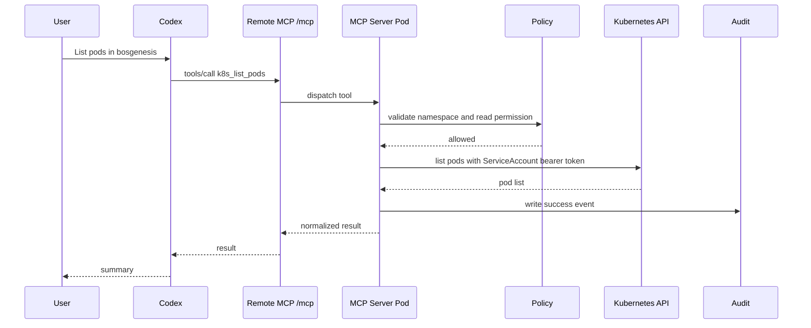
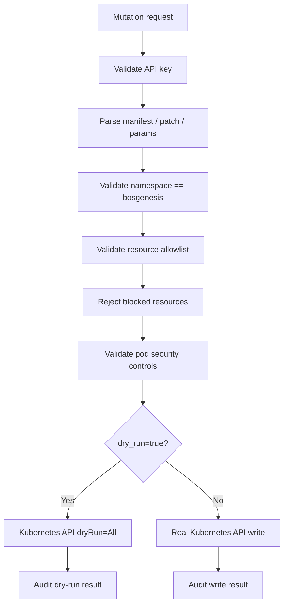
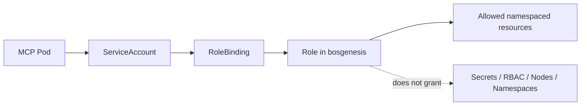

# BOS Genesis Kubernetes Inspector MCP - Design Specification

## Document Metadata

| Field | Value |
|---|---|
| Service | `bosgenesis-k8s-inspector-mcp` |
| Namespace | `bosgenesis` |
| Primary Endpoint | `http://k8s-inspector.bosgenesis.local/mcp` |
| REST Health Endpoint | `http://k8s-inspector.bosgenesis.local/health` |
| Runtime Auth | Kubernetes in-cluster ServiceAccount |
| Status | Implemented |

## Problem Statement

Codex and other AI agents need to inspect and operate BOS Genesis Kubernetes workloads without receiving raw kubeconfig or cluster-admin access.

The service provides a controlled remote MCP surface that runs inside Kubernetes and uses a namespace-scoped ServiceAccount. This keeps Kubernetes credentials inside the cluster and lets policy, RBAC, audit, and observability govern all operations.

## Functional Requirements

| ID | Requirement |
|---|---|
| FR-1 | Expose remote MCP tools over HTTP at `/mcp`. |
| FR-2 | Expose REST health and operational endpoints. |
| FR-3 | List pods, services, ConfigMaps, PersistentVolumeClaims, deployments, statefulsets, ingresses, and events in `bosgenesis`. |
| FR-4 | Describe pods and fetch bounded pod logs. |
| FR-5 | Apply, create, update, patch, delete, deletecollection, bind, and scale supported resources. |
| FR-6 | Support dry-run on mutating Kubernetes operations where Kubernetes supports it. |
| FR-7 | Reject all operations outside the configured namespace. |
| FR-8 | Reject blocked resources and unsafe pod specs. |
| FR-9 | Emit audit records for all tool/API operations. |
| FR-10 | Emit OpenTelemetry spans when enabled. |

## Non-Functional Requirements

| ID | Requirement |
|---|---|
| NFR-1 | Remote clients must not need kubeconfig. |
| NFR-2 | Kubernetes auth must use in-cluster ServiceAccount credentials. |
| NFR-3 | Mutating REST endpoints must require `X-API-Key`. |
| NFR-4 | Mutating MCP tools must require an `api_key` tool argument. |
| NFR-5 | The service must fail closed when API key is missing or placeholder. |
| NFR-6 | The service must not read or write Kubernetes Secrets. |
| NFR-7 | The service must not create or modify RBAC resources. |
| NFR-8 | The service must keep responses structured for agent summarization. |

## External Interfaces

### MCP Endpoint

```text
POST /mcp
Accept: application/json, text/event-stream
Content-Type: application/json
```

MCP clients must:

1. Send `initialize`.
2. Send `notifications/initialized`.
3. Use `tools/list`.
4. Use `tools/call`.

### REST Endpoint Summary

| Endpoint | Method | API Key | Description |
|---|---:|---:|---|
| `/health` | GET | No | Service and auth diagnostics. |
| `/namespace/summary` | GET | Yes when configured | Namespace summary. |
| `/pods` | GET | Yes when configured | List pods. |
| `/pods/{pod_name}` | GET | Yes when configured | Describe pod. |
| `/pods/{pod_name}/logs` | GET | Yes when configured | Pod logs. |
| `/services` | GET | Yes when configured | List services. |
| `/configmaps` | GET | Yes when configured | List ConfigMaps with metadata and key names only. |
| `/configmaps/{configmap_name}` | GET | Yes when configured | Read one ConfigMap; values require `include_data=true`. |
| `/pvcs` | GET | Yes when configured | List PersistentVolumeClaims. |
| `/pvcs/{pvc_name}` | GET | Yes when configured | Describe PersistentVolumeClaim. |
| `/deployments` | GET | Yes when configured | List deployments. |
| `/statefulsets` | GET | Yes when configured | List statefulsets. |
| `/ingresses` | GET | Yes when configured | List ingresses. |
| `/events` | GET | Yes when configured | List events. |
| `/apply` | POST | Required | Server-side apply. |
| `/create` | POST | Required | Create resource. |
| `/update` | POST | Required | Replace resource. |
| `/patch` | POST | Required | Patch resource. |
| `/delete` | POST | Required | Delete resource. |
| `/deletecollection` | POST | Required | Delete filtered collection. |
| `/bind` | POST | Required | Bind pending pod. |
| `/scale/deployment` | POST | Required | Scale deployment. |

## Tool Inputs

### Read Tool Example

```json
{
  "name": "k8s_get_configmap",
  "arguments": {
    "configmap_name": "example-config",
    "include_data": false,
    "actor": "codex"
  }
}
```

By default, ConfigMap reads return metadata and key names only. Set `include_data=true` only when values are explicitly needed. Kubernetes Secrets are never exposed through the MCP or REST surfaces.

### Mutation Tool Example

```json
{
  "name": "k8s_patch_resource",
  "arguments": {
    "resource": "deployments",
    "name": "example",
    "patch_json": "{\"spec\":{\"replicas\":2}}",
    "dry_run": true,
    "actor": "codex",
    "api_key": "configured-api-key"
  }
}
```

## End-to-End Request Flow



## Mutation Control Flow



## Policy Specification

### Namespace Policy

Only this namespace is permitted:

```text
bosgenesis
```

Any request with another namespace is denied before reaching Kubernetes.

### Blocked Resource Policy

Always blocked:

- `secrets`
- `serviceaccounts`
- `roles`
- `rolebindings`
- `clusterroles`
- `clusterrolebindings`
- `nodes`
- `namespaces`
- `persistentvolumes`
- `customresourcedefinitions`

### Blocked Subresources

- `pods/exec`
- `pods/attach`
- `pods/portforward`

### Pod Security Policy

Reject user payloads containing:

- `hostNetwork: true`
- `hostPID: true`
- `hostIPC: true`
- `hostPath` volumes
- privileged containers
- serviceAccountName override

## RBAC Specification



The Kubernetes Role is namespace-local and grants only the verbs and resources needed by the MCP server policy.

## Deployment Specification

Required Kubernetes objects:

- ServiceAccount
- Role
- RoleBinding
- ConfigMap
- Secret for API key
- Deployment
- Service
- Ingress
- NetworkPolicy

The Deployment must set:

```text
BOSGENESIS_K8S_AUTH_MODE=in_cluster
BOSGENESIS_ALLOWED_NAMESPACE=bosgenesis
BOSGENESIS_SETTINGS_FILE=/app/config/settings.yaml
BOSGENESIS_POLICY_FILE=/app/config/policy.yaml
BOSGENESIS_MCP_ALLOWED_HOSTS=k8s-inspector.bosgenesis.local,...
```

The pod must have:

```yaml
serviceAccountName: bosgenesis-k8s-inspector-mcp
automountServiceAccountToken: true
```

## Health Diagnostics

`/health` returns non-secret auth diagnostics:

```json
{
  "status": "ok",
  "namespace": "bosgenesis",
  "k8s_auth_mode": "in_cluster",
  "k8s_auth": {
    "serviceaccount_token_present": true,
    "serviceaccount_token_readable": true,
    "direct_incluster_client": true
  },
  "mcp_endpoint": "/mcp"
}
```

## Acceptance Criteria

| ID | Criteria |
|---|---|
| AC-1 | `GET /health` returns status `ok`. |
| AC-2 | `/health` reports `k8s_auth_mode` as `in_cluster` in Kubernetes. |
| AC-3 | `/health` reports ServiceAccount token present and readable. |
| AC-4 | MCP `initialize` succeeds at `/mcp`. |
| AC-5 | MCP `tools/list` returns all configured tools. |
| AC-6 | MCP `k8s_list_pods` returns pods from `bosgenesis`. |
| AC-7 | Cross-namespace requests are denied. |
| AC-8 | Secret manifests are denied. |
| AC-9 | Privileged and hostPath pod specs are denied. |
| AC-10 | Mutating tools fail without a valid API key. |
| AC-11 | MCP `k8s_list_configmaps` returns ConfigMap metadata and key names without values. |
| AC-12 | MCP `k8s_get_configmap` returns ConfigMap values only when `include_data=true`. |

## Manual Verification

Initialize MCP:

```bash
curl -i -N \
  -X POST \
  -H "Content-Type: application/json" \
  -H "Accept: application/json, text/event-stream" \
  http://k8s-inspector.bosgenesis.local/mcp \
  -d '{"jsonrpc":"2.0","id":1,"method":"initialize","params":{"protocolVersion":"2024-11-05","capabilities":{},"clientInfo":{"name":"manual-curl","version":"0.1.0"}}}'
```

List tools:

```bash
curl -i -N \
  -X POST \
  -H "Content-Type: application/json" \
  -H "Accept: application/json, text/event-stream" \
  -H "mcp-session-id: ${MCP_SESSION_ID}" \
  http://k8s-inspector.bosgenesis.local/mcp \
  -d '{"jsonrpc":"2.0","id":2,"method":"tools/list","params":{}}'
```

Call list pods:

```bash
curl -i -N \
  -X POST \
  -H "Content-Type: application/json" \
  -H "Accept: application/json, text/event-stream" \
  -H "mcp-session-id: ${MCP_SESSION_ID}" \
  http://k8s-inspector.bosgenesis.local/mcp \
  -d '{"jsonrpc":"2.0","id":3,"method":"tools/call","params":{"name":"k8s_list_pods","arguments":{"actor":"manual-curl"}}}'
```

## Risks and Mitigations

| Risk | Mitigation |
|---|---|
| Agent attempts cross-namespace access | Namespace policy and namespace-scoped RBAC. |
| Agent attempts Secret access | Policy blocks Secrets and RBAC omits Secrets. |
| ConfigMap accidentally contains sensitive values | List responses omit values; get responses require explicit `include_data=true`. |
| Agent attempts privileged pod creation | Pod security validation rejects unsafe fields. |
| Kubernetes auth becomes anonymous | Explicit ServiceAccount bearer token header in Kubernetes ApiClient. |
| Accidental broad deletecollection | Requires label or field selector and dry-run is recommended. |
| Exposed public endpoint | Use ingress/network controls and API-key guardrails for mutation. |
