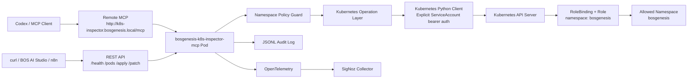
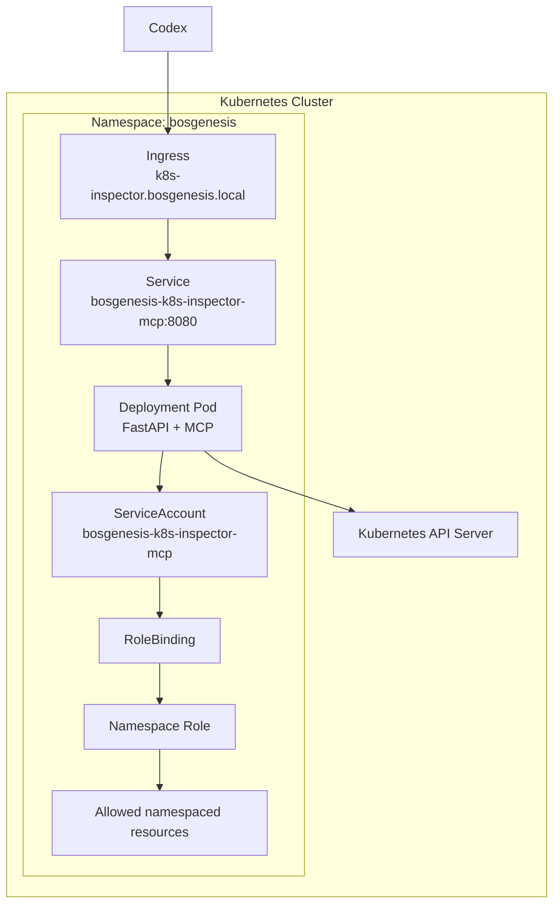
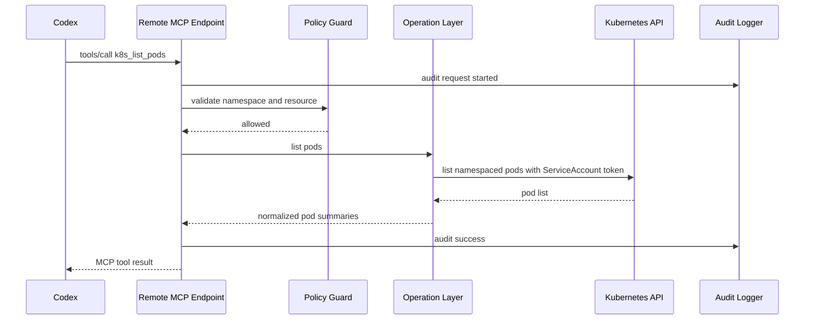

# BOS Genesis Kubernetes Inspector MCP - High Level Design

## Purpose

`bosgenesis-k8s-inspector-mcp` is a namespace-scoped Kubernetes operations service for the BOS Genesis platform.

It exposes:

- A remote Streamable HTTP MCP endpoint at `/mcp`
- A REST API for direct integrations and diagnostics
- A governed Kubernetes operation layer restricted to the `bosgenesis` namespace

The service runs inside Kubernetes and uses in-cluster authentication through its own ServiceAccount and namespace RoleBinding.

## Goals

- Let Codex and other MCP clients inspect BOS Genesis Kubernetes resources without local kubeconfig access.
- Allow controlled mutations for approved namespaced resources.
- Prevent cross-namespace and cluster-scoped operations.
- Block high-risk resources such as Secrets, RBAC resources, Nodes, Namespaces, PersistentVolumes, CRDs, exec, attach, and port-forward.
- Emit audit records and OpenTelemetry spans for all operations.

## Non-Goals

- Cluster administration.
- ClusterRole or ClusterRoleBinding management.
- Secret inspection or mutation.
- Pod exec, attach, or port-forward.
- Bypassing the policy engine.
- Providing raw Kubernetes credentials to Codex.

## Architecture Overview



## Runtime Deployment



## Major Components

| Component | Responsibility |
|---|---|
| FastAPI server | Serves REST API and mounts Streamable HTTP MCP at `/mcp`. |
| FastMCP server | Exposes MCP tools for reads and governed writes. |
| Policy engine | Enforces namespace, blocked resources, supported resources, and pod safety rules. |
| Operation layer | Normalizes Kubernetes list, get, apply, create, update, patch, delete, bind, and scale operations. |
| Kubernetes client | Uses in-cluster ServiceAccount token through explicit bearer authentication. |
| Audit logger | Emits JSON audit records for allowed, denied, successful, and failed operations. |
| Telemetry | Emits OpenTelemetry spans to SigNoz when enabled. |

## Data Flow



## Security Model

Security is enforced in layers:

1. Remote clients never receive kubeconfig or cluster credentials.
2. The pod uses in-cluster ServiceAccount authentication.
3. Kubernetes RBAC is namespace-scoped to `bosgenesis`.
4. The application policy engine blocks unsafe kinds, resources, namespaces, and pod specs.
5. Mutating MCP tools require an API key tool argument.
6. REST mutating endpoints require `X-API-Key`.
7. All operations produce audit records.

## Supported Resource Scope

Allowed read resources:

- Pods
- Pod logs
- Services
- ConfigMaps
- Deployments
- ReplicaSets
- StatefulSets
- DaemonSets
- Jobs
- CronJobs
- Events
- Ingresses
- PersistentVolumeClaims

Allowed write resources when policy allows:

- Pods
- Services
- ConfigMaps
- PersistentVolumeClaims
- Deployments
- ReplicaSets
- StatefulSets
- DaemonSets
- Jobs
- CronJobs
- Ingresses

Blocked resources:

- Secrets
- ServiceAccounts
- Roles and RoleBindings
- ClusterRoles and ClusterRoleBindings
- Nodes
- Namespaces
- PersistentVolumes
- CustomResourceDefinitions
- Pods exec, attach, and port-forward

ConfigMap reads are deliberately narrower than full raw Kubernetes objects by default. List operations return metadata and key names only, and single ConfigMap reads return values only when `include_data=true` is explicitly requested. This keeps ConfigMaps useful for diagnostics while preserving the stronger Secret guardrail.

## Availability and Operations

The service is deployed as a single replica by default. It is stateless except for ephemeral audit logs mounted on an `emptyDir`. It can be horizontally scaled later if audit persistence moves to a durable backend.

## Current Deployment Endpoint

```text
http://k8s-inspector.bosgenesis.local/mcp
```

Health endpoint:

```text
http://k8s-inspector.bosgenesis.local/health
```
