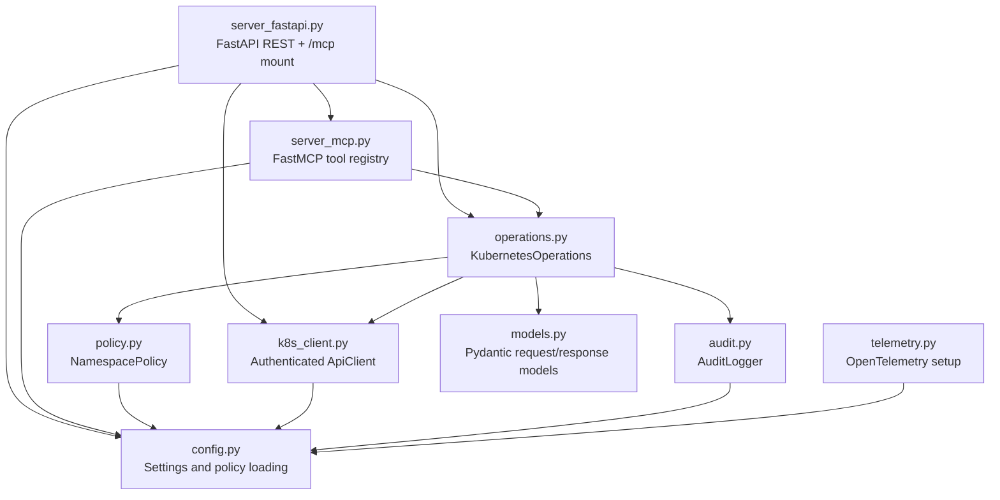
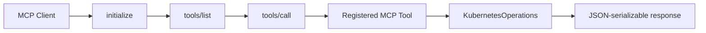
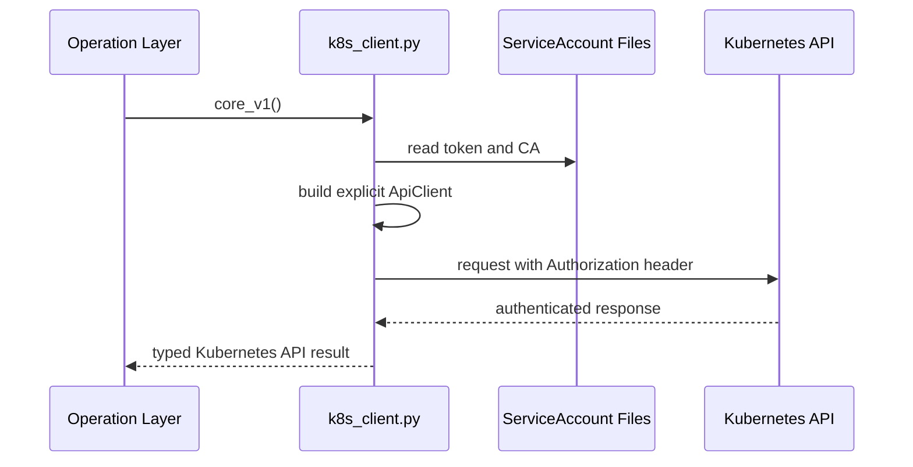
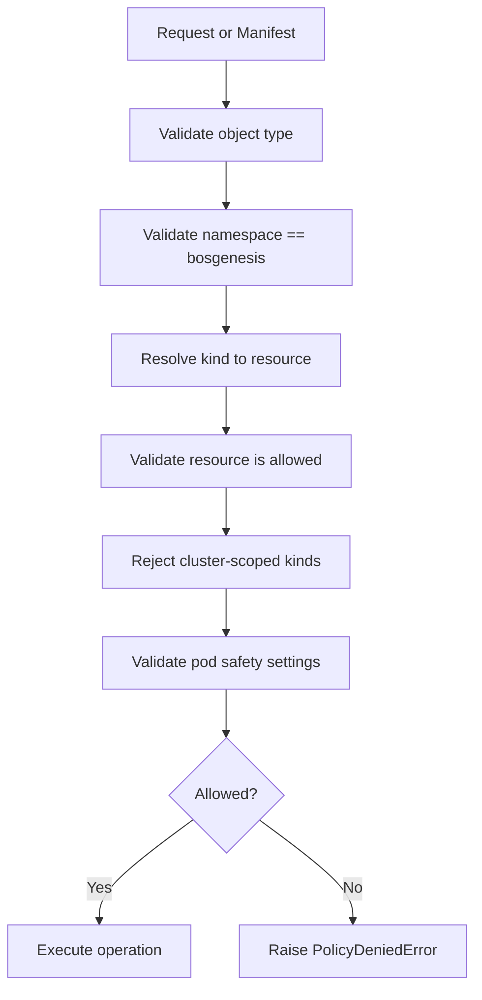
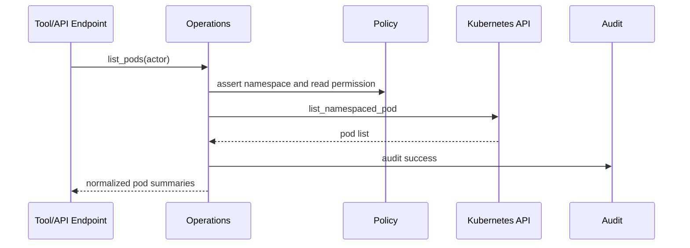
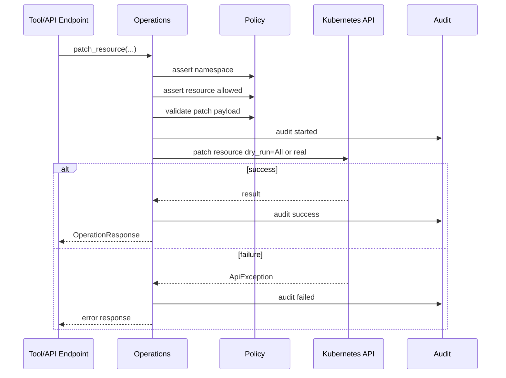
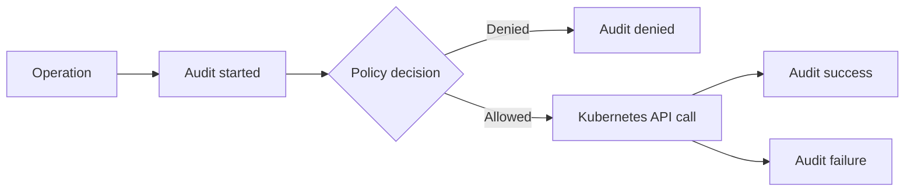

# BOS Genesis Kubernetes Inspector MCP - Low Level Design

## Module Map



## Entry Points

### REST and Remote MCP

File: `src/bosgenesis_k8s_inspector_mcp/server_fastapi.py`

Responsibilities:

- Creates the FastAPI app.
- Serves health and REST endpoints.
- Mounts the FastMCP Streamable HTTP app at `/mcp`.
- Starts the MCP session manager in FastAPI lifespan.
- Enforces `X-API-Key` for mutating REST endpoints.

Important routes:

| Route | Method | Purpose |
|---|---:|---|
| `/health` | GET | Health and auth diagnostics. |
| `/mcp` | POST | Streamable HTTP MCP endpoint. |
| `/pods` | GET | List pods. |
| `/services` | GET | List services. |
| `/configmaps` | GET | List ConfigMaps with metadata and key names only. |
| `/configmaps/{configmap_name}` | GET | Read one ConfigMap; values require `include_data=true`. |
| `/deployments` | GET | List deployments. |
| `/apply` | POST | Server-side apply. |
| `/create` | POST | Create supported resource. |
| `/update` | POST | Replace supported resource. |
| `/patch` | POST | Patch supported resource. |
| `/delete` | POST | Delete supported resource. |
| `/deletecollection` | POST | Delete selector-filtered collection. |
| `/bind` | POST | Bind pending pod to node. |
| `/scale/deployment` | POST | Scale deployment. |

### Stdio MCP

File: `src/bosgenesis_k8s_inspector_mcp/server_mcp.py`

Responsibilities:

- Creates the FastMCP app.
- Registers all MCP tools.
- Provides `streamable_http_app()` for FastAPI mounting.
- Enforces `api_key` argument for mutating MCP tools.

## MCP Tool Contract



Read tools:

- `k8s_namespace_summary`
- `k8s_list_pods`
- `k8s_describe_pod`
- `k8s_get_pod_logs`
- `k8s_list_services`
- `k8s_list_configmaps`
- `k8s_get_configmap`
- `k8s_list_deployments`
- `k8s_list_statefulsets`
- `k8s_list_ingresses`
- `k8s_list_events`

Write tools:

- `k8s_apply_manifest`
- `k8s_create_resource`
- `k8s_update_resource`
- `k8s_delete_resource`
- `k8s_delete_collection`
- `k8s_patch_resource`
- `k8s_bind_pod`
- `k8s_scale_deployment`

## Kubernetes Client Design

File: `src/bosgenesis_k8s_inspector_mcp/k8s_client.py`

The Kubernetes client supports:

- `kubeconfig` mode for local development.
- `in_cluster` mode for Kubernetes deployment.

In `in_cluster` mode, the client:

1. Reads `KUBERNETES_SERVICE_HOST`.
2. Reads `KUBERNETES_SERVICE_PORT`.
3. Reads the ServiceAccount token at `/var/run/secrets/kubernetes.io/serviceaccount/token`.
4. Reads the ServiceAccount CA at `/var/run/secrets/kubernetes.io/serviceaccount/ca.crt`.
5. Constructs an explicit `ApiClient`.
6. Adds `Authorization: Bearer <token>` to the ApiClient default headers.

This prevents anonymous Kubernetes API requests.



## Policy Engine

File: `src/bosgenesis_k8s_inspector_mcp/policy.py`

Validation steps:



Policy rejects:

- Namespace mismatch or missing namespace for manifests.
- Unsupported kinds.
- Blocked resources.
- Host networking.
- Host PID or IPC.
- HostPath volumes.
- Privileged containers.
- ServiceAccount override in workload specs.
- Dangerous patch payloads.

## Operation Layer

File: `src/bosgenesis_k8s_inspector_mcp/operations.py`

Key class:

```text
KubernetesOperations
```

Responsibilities:

- Enforce policy before Kubernetes API calls.
- Normalize read responses for agent-friendly output.
- Use dynamic Kubernetes client for generic create, update, apply, patch, and deletecollection.
- Use typed clients for common read and delete operations.
- Emit audit records for success, denial, and failure.

### Read Flow



### Mutation Flow



## Authentication and Authorization

### REST

Read routes use `require_api_key` when configured.

Mutating routes use `require_mutation_api_key`, which fails closed if:

- `BOSGENESIS_API_KEY` is missing.
- `BOSGENESIS_API_KEY` is still `change-me-later`.
- `X-API-Key` does not match.

### MCP

Read tools do not require `api_key`.

Mutating tools require an `api_key` argument. The value is compared against `BOSGENESIS_API_KEY`.

## Audit Model

Audit records include:

- Timestamp
- Actor
- Operation
- Namespace
- Resource kind
- Resource name
- Dry-run flag
- Correlation ID
- Decision
- Status
- Error or reason when applicable



## Error Handling

| Error Type | REST Status | Meaning |
|---|---:|---|
| `PolicyDeniedError` | 403 | Request violates namespace or resource policy. |
| `KubernetesOperationError` | 502 | Kubernetes API operation failed. |
| Other exception | 500 | Unexpected application error. |

## Configuration

Important environment variables:

| Variable | Purpose |
|---|---|
| `BOSGENESIS_ALLOWED_NAMESPACE` | Namespace boundary. |
| `BOSGENESIS_K8S_AUTH_MODE` | `in_cluster` for deployment, `kubeconfig` for local dev. |
| `BOSGENESIS_API_KEY` | REST and MCP mutation guardrail. |
| `BOSGENESIS_MCP_ALLOWED_HOSTS` | Host allowlist for MCP DNS rebinding protection. |
| `BOSGENESIS_SETTINGS_FILE` | Runtime settings file. |
| `BOSGENESIS_POLICY_FILE` | Policy file. |
| `BOSGENESIS_AUDIT_LOG_FILE` | JSONL audit log target. |
| `BOSGENESIS_OTEL_ENABLED` | Enables OpenTelemetry export. |

## Testing

Current tests cover:

- API key behavior.
- Audit event structure.
- Config path resolution and env precedence.
- HTTP MCP mount and health metadata.
- Kubernetes auth diagnostics and ServiceAccount header construction.
- Deletecollection selector requirement.
- Policy rejection of Secrets, wrong namespaces, hostPath, and dangerous patches.
